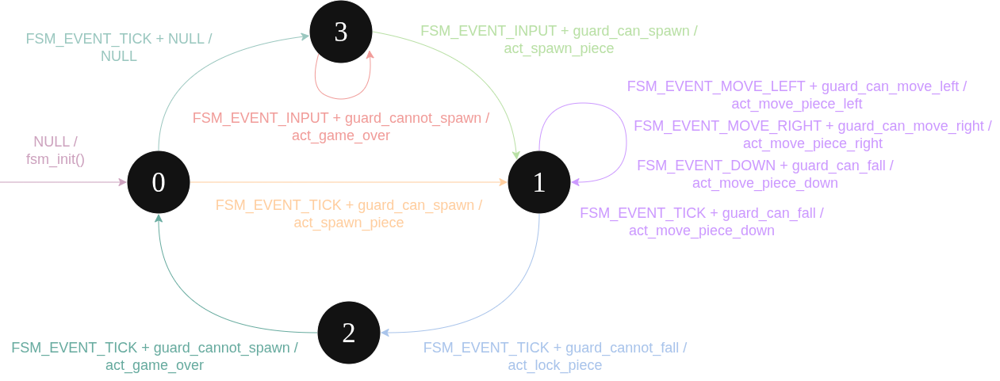

# Retro Arcade Embedded C

Plataforma de videojuegos retro en **C embebido** orientada a la construcción de juegos portables sobre hardware restringido.  
Actualmente el proyecto implementa **Tetris** con una arquitectura modular que separa la lógica del juego del hardware, permitiendo ejecutar el mismo núcleo en:

- **Terminal**
- **SDL2**
- **Arduino Uno** con matrices LED y botones físicos

## Objetivo del proyecto

El objetivo principal es desarrollar un juego embebido con una arquitectura limpia, portable y reutilizable, aplicando buenas prácticas de ingeniería de software en C, incluyendo:

- separación entre **núcleo del juego** y **capa de plataforma**
- uso de **máquina de estados finitos (FSM)**
- uso de **patrones de diseño** orientados a sistemas embebidos
- integración progresiva entre entorno de simulación y hardware real

## Arquitectura general

El proyecto se divide en dos partes principales:

### 1. Núcleo portable del juego
Contiene la lógica de Tetris y no depende directamente del hardware.  
Aquí viven los módulos:

- `board`
- `piece`
- `bag`
- `score`
- `game`
- `fsm`

### 2. Capa de plataforma
Implementa las interfaces concretas de entrada, visualización y tiempo para cada entorno:

- **host terminal**
- **host SDL2**
- **firmware AVR / Arduino Uno**

Esto permite que el mismo comportamiento del juego se reutilice con distintas interfaces sin modificar la lógica central.

## Máquina de estados finitos

La lógica del juego se modela mediante una **FSM (Finite State Machine)** que organiza el ciclo de vida de la pieza y del juego.  
Cada estado está representado por un valor numérico asociado a su `enum` correspondiente, y cada transición se expresa como:

**evento + guardia / acción**

A continuación se muestra el diagrama de estados actual del sistema:



## Estructura del repositorio

```text
.
├── README.md
├── LICENSE
├── tetris/
│   ├── CMakeLists.txt
│   ├── main_terminal.c
│   ├── main_sdl.c
│   ├── core/
│   ├── platform/
│   └── host/
├── avr_UNO_firmware/
│   ├── platformio.ini
│   ├── src/
│   └── lib/
└── tetris_core_pio/
    ├── include/
    ├── src/
    └── library.json
```

## Dependencias

### Para terminal y SDL2
- `CMake >= 3.10`
- compilador C compatible con C11
- `SDL2` para la versión gráfica

### Para Arduino Uno
- `PlatformIO`
- placa objetivo: `Arduino Uno`

## Compilación y ejecución

### 1. Ejecutar en terminal

Desde la raíz del repositorio:

```bash
cd tetris
cmake -S . -B build
cmake --build build --target tetris_terminal
./build/tetris_terminal
```

También puedes usar el target auxiliar definido en CMake:

```bash
cmake --build build --target run_terminal
```

### 2. Ejecutar con SDL2

Desde la raíz del repositorio:

```bash
cd tetris
cmake -S . -B build
cmake --build build --target tetris_sdl
./build/tetris_sdl
```

O usando el target auxiliar:

```bash
cmake --build build --target run_sdl
```

### 3. Compilar y cargar en Arduino Uno

Desde la carpeta del firmware:

```bash
cd avr_UNO_firmware
pio run
pio run -t upload
```

Si quieres limpiar primero:

```bash
pio run -t clean
pio run
```

## Controles del juego

### En PC
- `←` mover a la izquierda
- `→` mover a la derecha
- `↓` acelerar caída
- tecla de rotación según la implementación activa

### En Arduino Uno
- botón `LEFT`
- botón `RIGHT`
- botón `DOWN`
- botón `ROTATE`

## Decisiones de diseño relevantes

- El sistema usa una **FSM tabulada** para describir estados, eventos, guards y acciones.
- Se busca que exista **una sola pieza viva** a la vez, reduciendo complejidad y uso de memoria.
- El tablero mantiene únicamente el **estado fijo** de las piezas bloqueadas.
- La entrada y el display se desacoplan del núcleo mediante interfaces de plataforma.
- El firmware del Arduino usa un enfoque tipo **cyclic executive**, con multiplexado de display y lectura periódica de botones.
- El núcleo portable se reutiliza en PlatformIO como librería local mediante `tetris_core_pio`.

